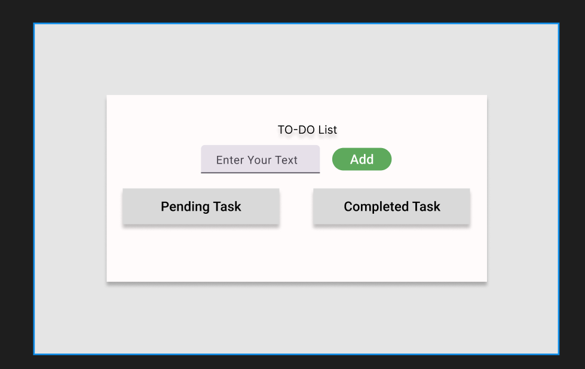

# Minimalistic To-Do List

A simple, minimalistic To-Do List web application that helps you manage your tasks effectively. The app allows users to add tasks, mark them as completed, edit, and delete tasks.

## Features

- **Add Tasks**: Enter tasks in the input field and add them to the pending list.
- **Mark Tasks as Completed**: Check off tasks when they are done, and they will move to the completed list.
- **Edit Tasks**: Easily edit any task inline by clicking the "Edit" button.
- **Delete Tasks**: Remove tasks from the list using the "Delete" button.
- **Responsive Design**: The layout adapts to different screen sizes and devices.
- **Gradient Color Scheme**: A visually appealing gradient background with clean UI design.

## Technologies Used

- **HTML5**: Structure and layout of the application.
- **CSS3**: Styling, including flexbox for layout and custom designs using gradients.
- **JavaScript**: Core functionality, including adding, editing, deleting, and marking tasks as completed.

## Figma Mock Design

You can view the Figma mock design for this project [here](https://www.figma.com/design/WXU96oPW34YAEvt6X1Qafx/Untitled?node-id=0-1&t=1B7EB1L6VFJxvEWj-1).



## Installation

1. Clone the repository:
   ```bash
   git clone https://github.com/your-username/todo-list.git
   ```

2. Navigate to the project directory:
   ```bash
   cd todo-list
   ```

3. Open `index.html` in your browser:
   ```bash
   open index.html
   ```

## File Structure

```
/todo-list
│
├── /todo
│   ├── style.css          # CSS styles for the To-Do List
├── index.html             # Main HTML file
└── README.md              # Project documentation
```

## Usage

1. Enter a task in the input field.
2. Click the "Add Task" button to add it to the Pending Tasks list.
3. Mark tasks as completed by clicking the checkbox next to each task.
4. Edit tasks by clicking the "Edit" button, updating the text, and pressing Enter or clicking outside the input.
5. Delete tasks by clicking the "Delete" button.


